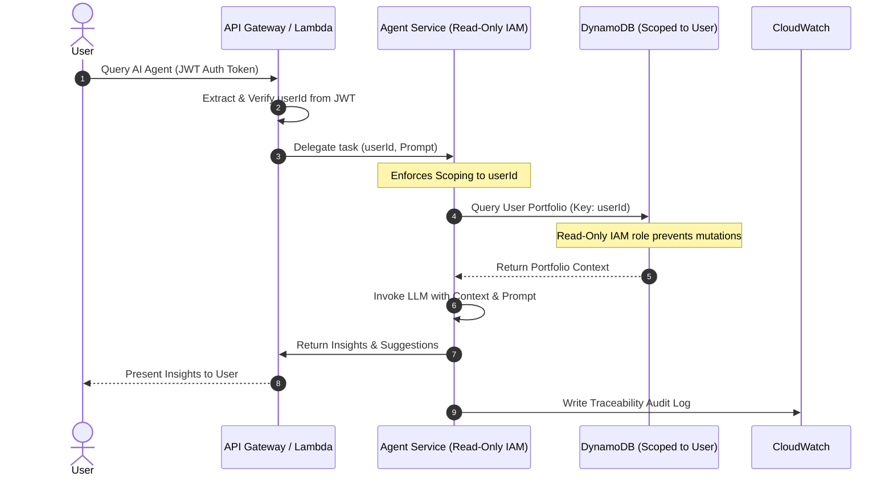

# AI Agent Operating Model

**Status**: Approved  
**Date**: 2026-07-13  
**Context**: Defining the architectural boundaries, security constraints, and capabilities for the AI/LLM agents within the Kesahomma26 platform.

---

## 1. Goal

The AI agents are designed to analyze portfolios, evaluate historical transactions, and provide personalized insights. The boundaries of what they can read, produce, and store are defined as follows:

*   **What AI Agents Can Read**:
    *   The requesting user's portfolio data and asset allocations.
    *   The requesting user's transaction history (buys, sells, prices, quantities, timestamps).
    *   Standard market data (historical and current ticker/stock/cryptocurrency prices).
    *   User-specific preferences explicitly provided during the session.
*   **What AI Agents Can Produce**:
    *   Portfolio health checks and performance analysis.
    *   Non-binding rebalancing suggestions and asset allocation recommendations.
    *   Explanatory insights regarding transaction trends and history.
*   **What AI Agents Can Store**:
    *   Traceability/Audit logs of the interaction (including user prompt, raw context injected, model inputs/outputs).
    *   System execution metrics (latency, token counts, cost indicators).
    *   *AI agents are prohibited from storing or caching raw user financial data in persistent agent-level state.*

---

## 2. Core Security & Operational Constraints

To maintain system integrity, data privacy, and strict cost controls, the following three core constraints are enforced:

### Constraint 1: Read-Only Operations (No Mutations)
AI agents operate in a strictly read-only capacity relative to primary transaction and portfolio state.
*   **No Execution**: Agents cannot execute trades or place orders on behalf of users.
*   **No Mutations**: Agents are prohibited from adding, modifying, or deleting transactions, portfolios, or any other user-owned state.
*   **Database Constraints**: The AWS IAM execution roles for the background agents must not have `dynamodb:PutItem`, `dynamodb:UpdateItem`, or `dynamodb:DeleteItem` permissions on user transaction and portfolio tables.

### Constraint 2: Strict Multi-Tenant Data Isolation
To prevent cross-tenant data leakage, the agent runtime must enforce absolute data isolation.
*   **User Scoping**: Every query, request, or retrieval operation initiated by the agent must be bound to the requesting user's `userId` (derived securely from the JWT claim verified by Cognito).
*   **No Cross-Tenant Querying**: Database queries must use partition keys scoped specifically to the requesting user. The system must block any cross-tenant data querying at the database access client layer, preventing any data belonging to other tenants from being retrieved as context for the agent.

### Constraint 3: Traceability & Auditing
All interaction lifecycles with the LLM/foundation model must be logged and auditable to track system safety, hallucination rates, and security compliance.
*   **Prompt & Input Auditing**: The system must log the exact user input and the resolved system/context prompt sent to the LLM.
*   **Output Auditing**: The raw model output must be preserved for audit.
*   **Safety Configurations**: The safety filter thresholds (e.g., toxicity, hate speech, financial advice disclaimers) and model parameters (temperature, max tokens) used for each invocation must be documented in the logs.
*   **Storage**: Audit logs must be shipped to Amazon CloudWatch with a strict 7-day retention policy to manage storage costs while maintaining a complete trace of recent activity.

---

## 3. Enforcement & Architecture Reference

The following diagram illustrates how these constraints are enforced at the API and database levels:

